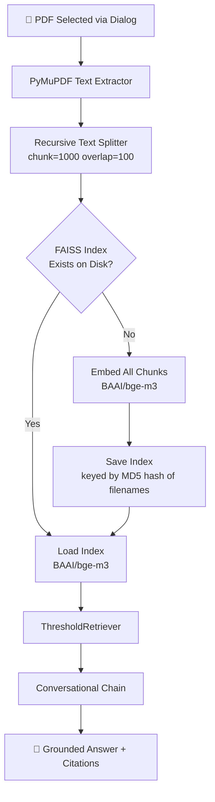
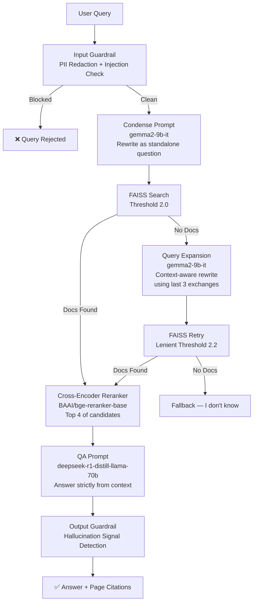
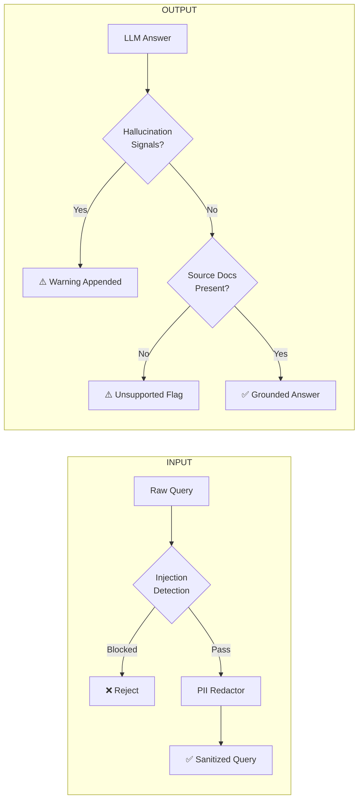
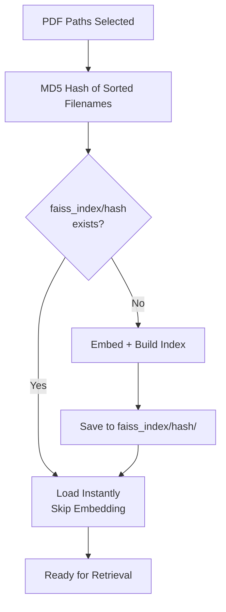

# PAPER BRAIN
> Conversational RAG pipeline for querying research PDFs with grounded, cited answers.

---

## Table of Contents
1. [Intuition](#intuition)
2. [Features](#features)
3. [Architecture](#architecture)
4. [Specific Implementations](#specific-implementations)
5. [Why This Architecture](#why-this-architecture)
6. [Future Improvements](#future-improvements)

---

## Intuition

Reading a 70-page research paper to find one specific metric is a waste of time. Paper Brain lets you talk to the document — ask questions in plain language, get answers grounded strictly in the paper's content, with exact page citations. If the answer isn't in the document, it says so. No hallucinations, no guessing.

---

## Features

- **Conversational memory** — follow-up questions retain context across the session
- **Two-tier retrieval** — strict threshold first pass, lenient on expansion retry
- **Query expansion** — failed retrievals trigger an LLM-powered rewrite using last 3 exchanges as context before giving up
- **Cross-encoder reranking** — FAISS candidates are reranked by a dedicated reranker model before being passed to the LLM
- **PII redaction** — email, SSN, PAN, Aadhaar (Verhoeff), credit cards (Luhn), phone, passport, IP stripped from every query
- **Prompt injection detection** — jailbreak and role-override phrases blocked at input
- **Hallucination guardrail** — output scanned for training-data leakage signals before returning to user
- **Persistent FAISS index** — index built once per PDF, hash-keyed by filename, reloaded on subsequent runs
- **Chat log export** — every session saved as `.json` and `.md`
- **File picker UI** — tkinter dialog, no manual folder management

---

## Architecture

### System Overview

### Retrieval Pipeline

### Guardrails

### FAISS Persistence

---

## Specific Implementations

| Component | Choice | Reason |
|---|---|---|
| Embedding | `BAAI/bge-m3` | Tops MTEB retrieval benchmarks, strong on dense technical text |
| Reranker | `BAAI/bge-reranker-base` | Same model family as embedder, consistent semantic space |
| QA LLM | `deepseek-r1-distill-llama-70b` | Precise factual extraction, context-grounded reasoning |
| Utility LLM | `gemma2-9b-it` | Fast and cheap for condensing and query expansion tasks |
| Vector Store | `FAISS` | Local, fast, no infrastructure required |
| PDF Parser | `PyMuPDF` | Best text extraction quality among free Python PDF libraries |
| Aadhaar Validation | Verhoeff algorithm | Checksum-based, reduces false positives significantly |
| Card Validation | Luhn algorithm | Industry standard credit card checksum |

---

## Why This Architecture is Better

**vs. naive RAG** — vanilla RAG retrieves top-k by similarity and passes directly to LLM. This pipeline adds a threshold filter to reject low-confidence chunks, a cross-encoder reranker to reorder candidates by relevance, and a query expansion fallback before giving up. Each layer reduces hallucination surface.

**vs. single LLM for everything** — using `gemma2-9b-it` for lightweight tasks (condensing, expansion) and `deepseek-r1-distill-llama-70b` only for QA means faster responses on simple operations without sacrificing answer quality where it matters.

**vs. session-only indexes** — persisting the FAISS index to disk keyed by filename hash means repeat queries on the same document skip embedding entirely. For large documents this is the difference between a 30-second startup and an instant one.

---

## Future Improvements

- **Streaming responses** — answers appear token by token instead of all at once
- **RAGAS evaluation** — automated faithfulness and relevancy scoring per session (partially implemented, blocked on ragas 0.2+ API migration)
- **Block-level ingestion** — PyMuPDF block extraction for paragraph-level citations instead of page-level. Tested: 70-page PDF goes from 145 to 1712 chunks — needs chunk deduplication strategy before viable
- **PostgreSQL + pgvector** — replace FAISS with a persistent vector database for multi-user and multi-session support
- **Redis caching** — cache frequent query-response pairs for sub-second retrieval on repeated questions
- **HyDE** — Hypothetical Document Embedding: generate a fake answer first, embed it, use that embedding for retrieval instead of the raw question
- **Streamlit UI** — replace terminal loop with a proper chat interface
- **Async processing** — `asyncio` + LangChain async methods for concurrent retrieval and LLM calls