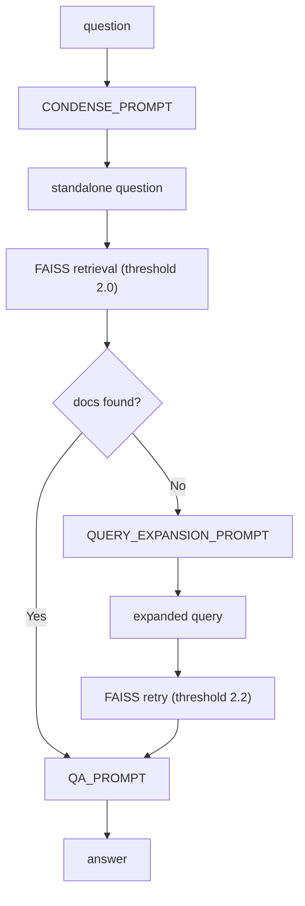

# Paper Brain
---
## Query expansion mechanism

```mermaid
flowchart TD
    A[question] --> B[CONDENSE_PROMPT]
    B --> C[standalone question]

    C --> D["FAISS retrieval (threshold 2.0)"]

    D --> E{docs found?}

    E -->|Yes| H[QA_PROMPT]

    E -->|No| F[QUERY_EXPANSION_PROMPT]
    F --> G[expanded query]
    G --> I["FAISS retry (threshold 2.2)"]

    I --> H

    H --> J[answer]
```

